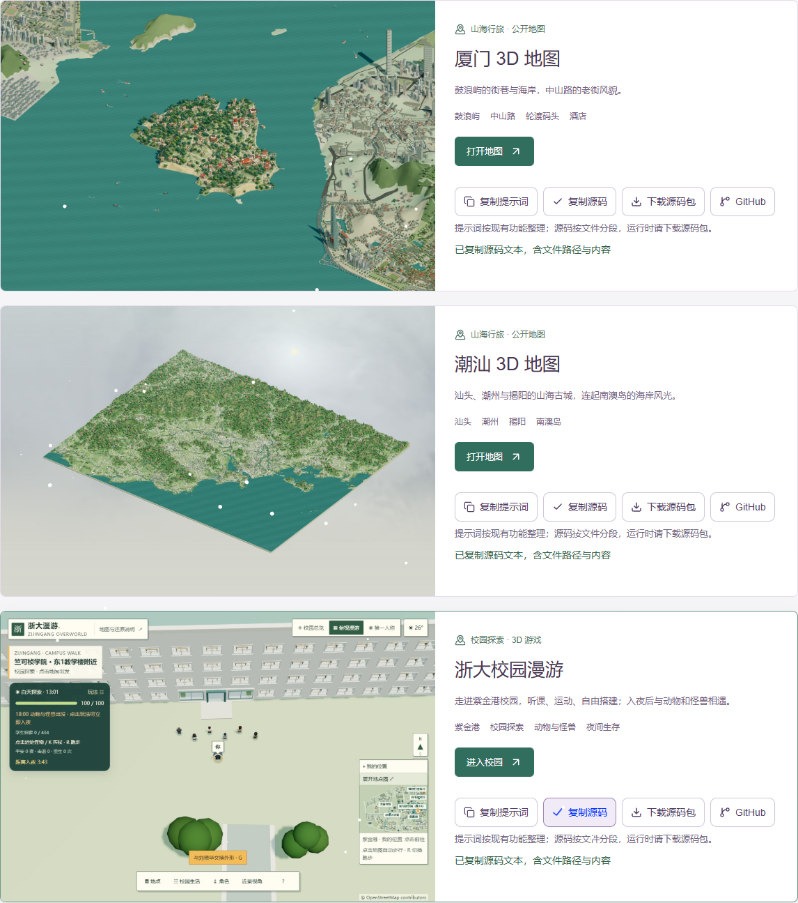

# Codex Pulse

一个集用量面板、3D 地图和浏览器小游戏于一体的个人工作台。

[在线体验](https://codex-pulse-willow-0911.wozhe0196.chatgpt.site/) · [地图与游戏源码包](https://github.com/zhanghaoquan631/codex-pulse/releases/tag/source-v1.0.0) · [资源许可](LICENSES.md)



## 可以做什么

- 查看 Codex 用量，整理网站和灵感；用量数据需要自行配置采集器。
- 探索潮汕、厦门 3D 地图，体验潮汕十二章行旅、公鸡快跑和浙大校园漫游。
- 在地图和游戏页面直接**复制提示词、复制源码**，也可下载保留目录与资源的 ZIP。
- 使用预约、音乐和其他集成入口；外部服务需要独立配置。


## 本地运行

使用 Node.js 24.5 或更新版本：

```bash
git clone https://github.com/zhanghaoquan631/codex-pulse.git
cd codex-pulse
npm run install:ci
npm run dev
```

打开终端显示的本机地址；地图入口为 `/#atlas`，小游戏为 `/#rooster`，旅行地图卡片为 `/#knowledge?view=library`。使用 `npm run build` 构建。

地图和游戏可独立运行。数据库、采集器和外部服务设置见 [开发说明](docs/development.md)。仓库不包含线上数据库、登录凭据或个人采集记录。

## 源码在哪

| 内容 | 目录 |
| --- | --- |
| 工作台页面与 API | `app/`、`lib/`、`components/` |
| 潮汕地图可编辑示例 | `examples/chaoshan-3d-map/` |
| 厦门地图可编辑示例 | `examples/xiamen-3d-map/` |
| 浙大校园漫游 | `examples/zju-overworld/` |
| 线上共创地图与构建脚本 | `public/local-apps/chaoshan-atlas/`、`integration/chaoshan-*/` |
| 潮汕行旅 | `public/local-apps/chaoshan-atlas/adventure/` |
| 公鸡快跑 | `public/games/rooster-rush/` |
| 复现提示词与复制按钮 | `lib/source-library.ts`、`app/source-actions.tsx` |
| 采集器与数据库迁移 | `collector/`、`drizzle/` |

提示词按现有功能整理，并非原始对话逐字记录。复制源码得到按文件路径分段的代码；ZIP 还包含地理数据和可分发资源。独立地图示例与线上已构建地图分别保存，版本关系见各示例的 `SOURCE-NOTES.md`。

## 技术与许可

React 19 · Vinext · TypeScript · Three.js · Cloudflare Workers / D1

这是源码公开仓库，**没有统一的全仓库 MIT 授权**。新增复制功能采用 MIT；QDuo、地图数据、字体和第三方模块保留各自许可。受限角色模型和部分插画未包含在公开包中，默认程序化角色保留。请阅读 [LICENSES.md](LICENSES.md) 与各资源的来源说明。
